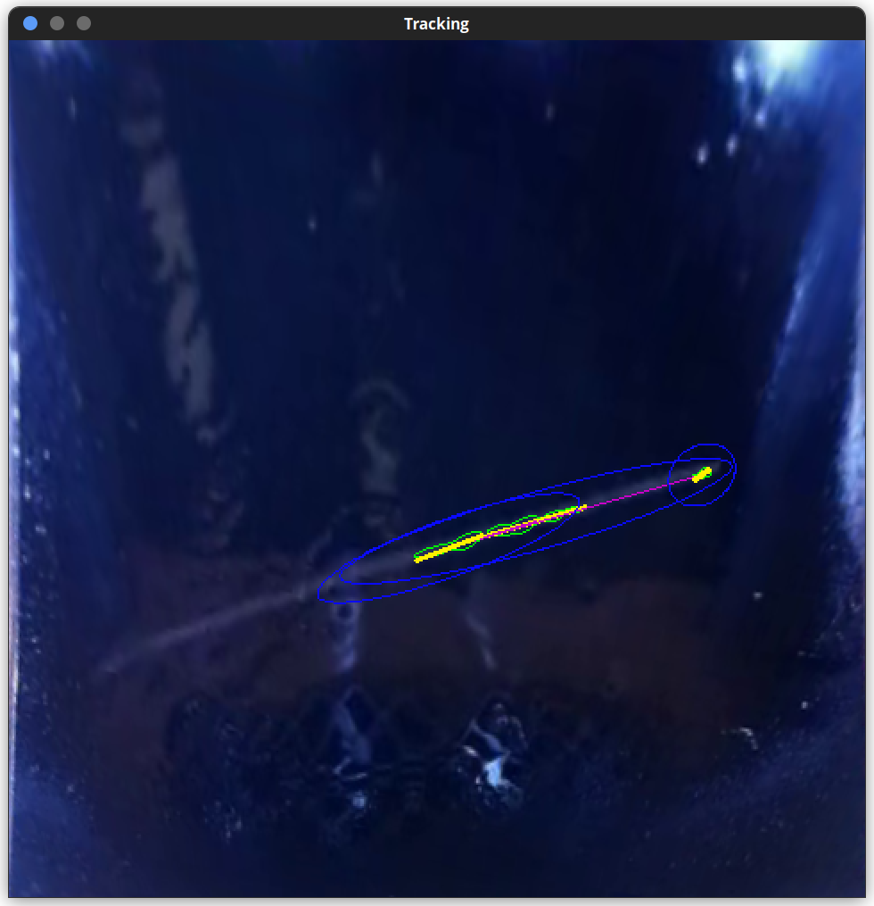
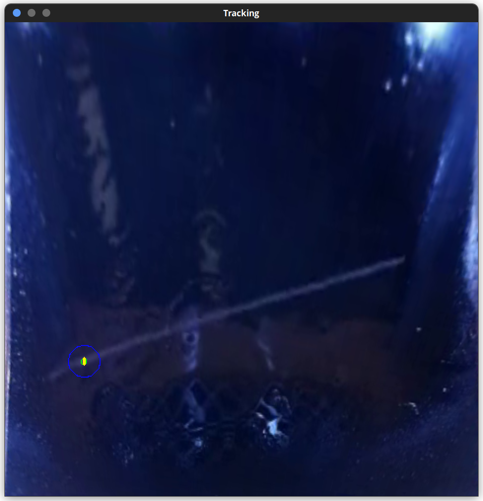
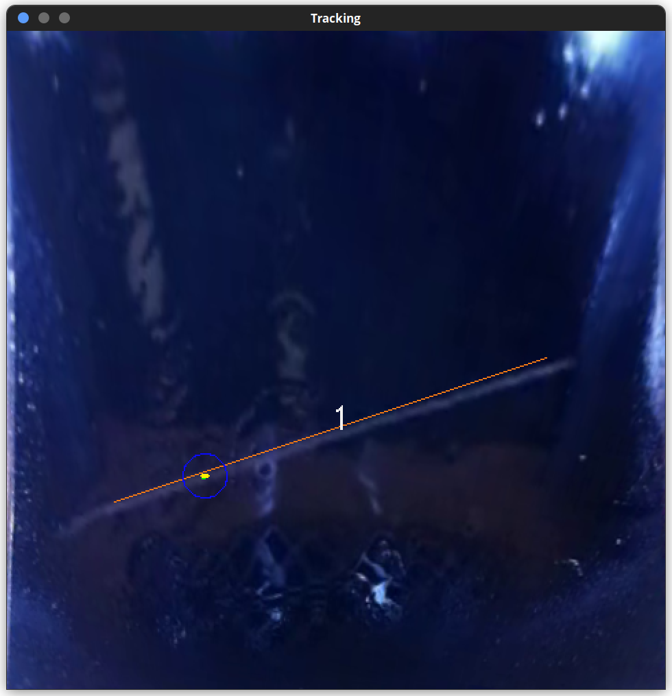
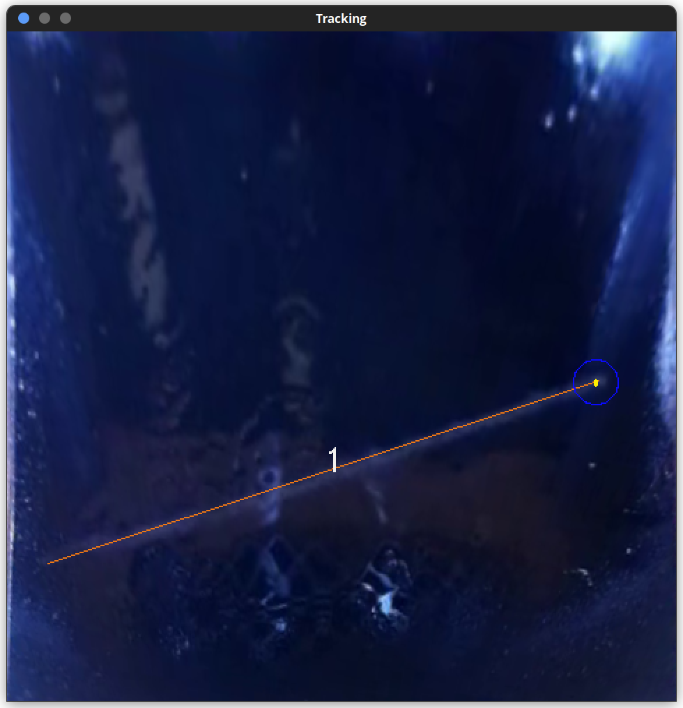
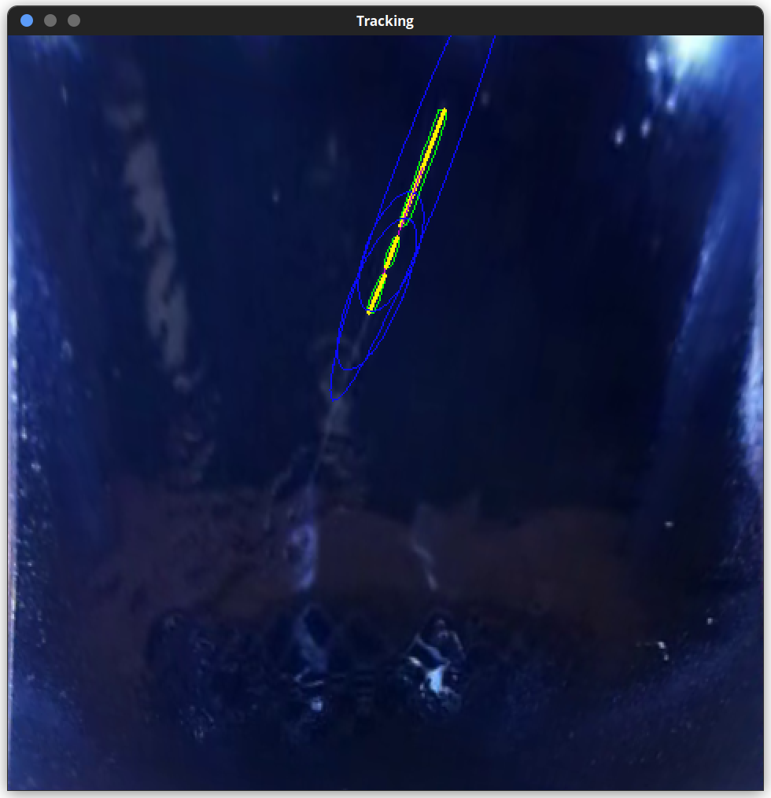
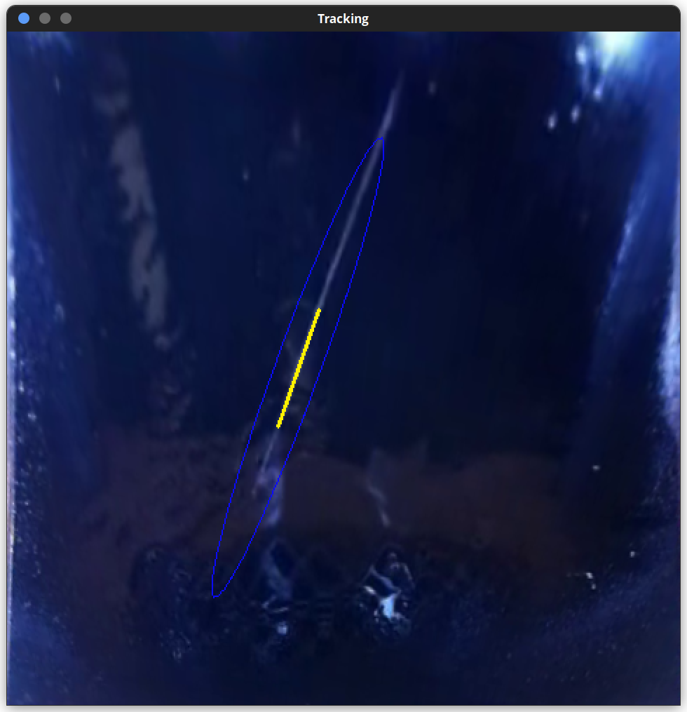
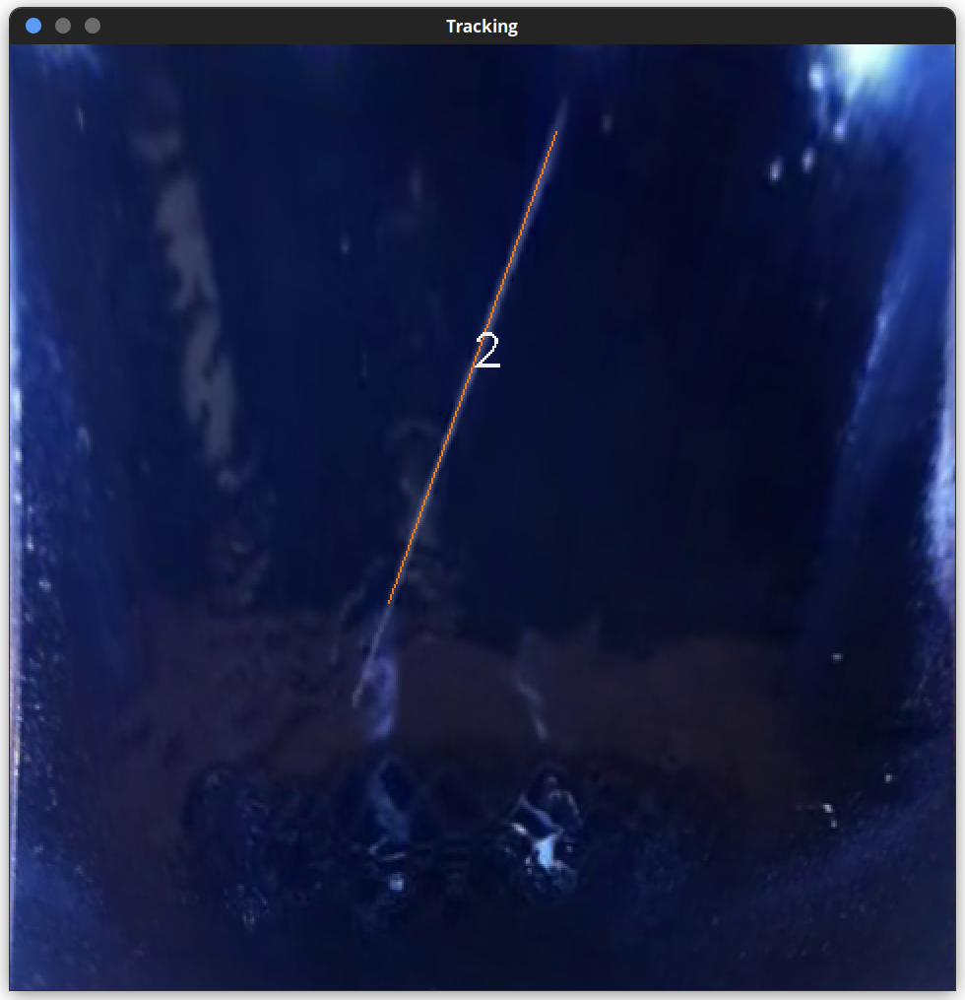

# Alpha Tracker

Alpha Tracker è un software scritto in C++ che utilizza la libreria OpenCV (Open Source Computer Vision Library) per rilevare in tempo reale le tracce di particelle alfa rivelate dalla camera a nebbia con celle di Peltier. La cattura del video può avvenire tramite fotocamera integrata, IP camera o da file video.

## Istruzioni

### Setup (Raspberry Pi)

1. Avviare il programma dall'icona verde in alto a sinistra.
2. Posizionare il Raspberry Pi sulla camera a nebbia e direzionare la fotocamera verso la piastra nera.

### Utilizzo

1. Selezionare la modalità di cattura del video.
2. Premere invio quando la piasta viene correttamente contornata dal quadrilatero verde.
3. Utilizzare i comandi descritti a seguire per interagire con il programma e modificare la visualizzazione.

### Comandi

L'interazione con il programma avviene unicamente da tastiera e solo quando il focus è sulla finestra con il video.

+ **Selezione della modalità di cattura**
    - <kbd>↓</kbd>/<kbd>↑</kbd> scorre le opzioni
    - <kbd>Invio</kbd>  conferma l'opzione selezionata
    - <kbd>Esc</kbd>    termina l'esecuzione del programma
+ **Correzione della prospettiva**
    - <kbd>Invio</kbd>  seleziona i vertici attualmente visualizzati
    - <kbd>Esc</kbd>    termina l'esecuzione del programma
+ **Rilevazione delle tracce**
    - <kbd>↓</kbd>/<kbd>↑</kbd> scorre i parametri
    - <kbd>→</kbd>/<kbd>←</kbd> modifica il parametro attualmente selezionato
    - <kbd>0</kbd>     ripristina i valori predefiniti dei parametri
    - <kbd>+</kbd>     pausa/play (se in pausa, è possibile premere un tasto qualsiasi per avanzare al frame successivo)
    - <kbd>Invio</kbd><kbd>Esc</kbd><kbd>Spazio</kbd>  termina l'esecuzione del programma


### Schermata di tracking

```
 ╭─────── Vista ────────╮ ╭───────── Eventi ─────────╮
 │                      │ │ ID  frame  len  dir life │
 ├╴Maschera  smussata   │ │ 13  565    173   62   14 │
 │                      │ │ 14  565     26   77   10 │
 │ Sfondo    ███████░░░ │ │ 15  570    348  -67   10 │
 │                      │ │ 16  607     19   38    6 │
 │ Tracce    [x]        │ │ 17  613     49  -69   11 │
 │                      │ │ 18  634    246  -64   13 │
 │ Numeri    [ ]        │ │ 19  728     91  -33   13 │
 │                      │ │ 20  753    115   35   14 │
 ╰──────────────────────╯ │ 21  836    108   90   11 │
 ╭─────── Stato ────────╮ │ 22  857    242   41    8 │
 │                      │ │ 23  872      6    0    5 │
 │  Conteggio      29   │ │ 24  889      6    0    7 │
 │                      │ │ 25  904    118   65   14 │
 │  FPS            67   │ │ 26  930    222   44   14 │
 │                      │ │ 27  938     13   85    4 │
 │  Tempo         990   │ │ 28  950      5    0    8 │
 │                      │ │ 29  971      5    0    4 │
 ╰──────────────────────╯ ╰──────────────────────────╯
                                   
```

#### Parametri
- **Maschera**: seleziona il tipo di maschera da visualizzare
- **Sfondo**: trasparenza dello sfondo (0 = solo bianco e nero, 10 = solo sfondo) 
- **Tracce**: mostra/nasconde i segmenti delle tracce
- **Numeri**: mostra/nasconde il conteggio delle tracce
#### Elementi visualizzabili
- **Ellissi**: disegna un ellisse attorno a ciascuna traccia
- **Segmenti**: disegna i segmenti che collegano i blob allineati
- **Contorni**: disegna i contorni dei blob

Modificabili in `settings.ini`
#### Eventi
A seconda dello stato di un raggio, esso viene colorato diversamente nella tabella:
- i raggi in fase di validazione sono colorati in arancione, a significare che il loro tempo di vita è ancora troppo breve per confermare che non siano falsi positivi;
- i raggi confermati che hanno un tempo di vita superiore ai 3 frames e che sono ancora visibili sul video sono colorati di verde;
- i raggi confermati che non sono più visibili sono visualizzati in bianco.


## Funzionamento del programma

### Correzione della prospettiva
1. Si applica un `threshold` al frame del video convertito in scala di grigi, in modo da isolare la piastra nera dal resto dell'immagine.
2. Si usa `findContours` per trovare i contorni presenti nell'immagine binaria così ottenuta e si cerca quello al centro dell'immagine.
3. Si esegue l'algoritmo di approssimazione della forma del contorno `approxPolyDP` sul contorno così trovato, al fine di ottenere il quadrilatero che circonda la piastra nera.
4. Si applicano operazioni di trasformazione delle matrici per trasformare l'area sottesa dal quadrilatero nell'immagine originale, in modo che diventi quadrata.

### Rilevazione delle tracce

#### Terminologia
- traccia: insieme di pixels bianchi contigui che rappresentano parte di una scia visibile di una radiazione;
- segmento: approssimazione di una traccia ad un segmento;
- raggio: approssimazione di un insieme di segmenti allineati ad un altro segmento.

#### Procedimento in breve
1. Trasformare l'immagine di input in un'immagine binaria contenente le tracce (blob) presenti nel frame.
2. Rimuovere dalle tracce attuali quelle già analizzate nei frames precedenti.
3. Approssimare le nuove tracce a segmenti.
4. Aggiornare i raggi già calcolati con le eventuali nuove tracce allineate ad essi.
5. Unire i nuovi segmenti allineati fra loro per formare un unico raggio.
6. Visualizzare i risultati.

#### Algoritmo
1. Si applica l'algoritmo di background subtraction MOG2 al video con la prospettiva corretta, così da ottenere una maschera binaria che mostra i pixel che differiscono dallo sfondo statico.
2. Un sistema di controllo evita che il frame venga analizzato se troppo diverso dai precedenti (i.e. l'area bianca supera una certa soglia), ad esempio a causa di cambiamenti di luce o spostamento della telecamera.
3. Si applicano operazioni morfologiche, sfocature e soglie per ripulire l'immagine; si cercano i contorni con `findContours` che si usano per popolare un vettore `segments` di oggetti `Segment`:
    ```c++ 
    class Segment {
        vector<cv::Point> contour;  // output di `findContours`
        cv::RotatedRect minRect;    // output di `minAreaRect(contour)`
        cv::Point A;  // estremo iniziale
        cv::Point B;  // estremo finale
        cv::Point M;  // punto medio
        int len;      // lunghezza
        int dir;      // direzione (-90,90]
    }
    ```
4. Spesso capita che la traccia di uno stesso raggio sia spezzata in più di un blob, quindi si connettono tali segmenti:
   1. si scorrono i segmenti `i` del vettore `segments` per lunghezze decrescenti;
   2. si scorrono i segmenti `j`, tali che `i != j && j.len <= i.len`, per lunghezze decrescenti;
   3. per entrambi i segmenti si disegna attorno ad essi un'ellisse avente:
      - centro coincidente con il punto medio del segmento;
      - asse maggiore parallelo al segmento;
      - asse maggiore lungo il doppio della lunghezza del segmento;
      - asse minore con una lunghezza fissa arbitraria (circa 5 volte la larghezza di una traccia)
   4. si calcola il rapporto fra l'area dell'intersezione dei due ellissi e l'area dell'ellisse di `j`;
   5. se tale valore supera una certa soglia (10%), allora i due segmenti sono allineati e possono essere connessi; la connessione viene memorizzata in una lista di adiacenza (`join[i].push(j)`);
   6. altrimenti, se entrambi i segmenti sono più corti di una certa soglia, essi vengono connessi se la distanza fra i loro punti medi è inferiore ad un altro valore di soglia;
   7. una volta finite le iterazioni si calcolano le componenti connesse di `join`; per ogni componente connessa (insieme di segmenti) si trova il raggio effettivo che ricopre l'intera traccia:
      1. si disegna una linea corrispondente ad ogni segmento della componente;
      2. si disegna una linea che connette il punto medio di un segmento al punto medio del successivo;
      3. si è così ottenuta un'area di pixels bianchi contigui, che può essere dunque racchiusa in un unico contorno tramite `findContours`;
      4. si calcola il  `minAreaRect` di tale contorno, che viene utilizzato per costruire un oggetto `Ray`:
         ```c++
         class Ray {
             int id, len, dir, frame, life;
             cv::Point A, B, M;
             bool alive;
         };
         ```
      5. si aggiunge il raggio così ottenuto al vettore dei raggi "in vita" `alive`.
5. Si disegnano sul video i raggi "in vita" e si registrano le specifiche nel log.

Si ripetetono le operazioni da 1 a 5 per i frames successivi, con le seguenti modifiche, che permettono di gestire il susseguirsi dello stesso raggio in frames diversi.
1. Tra i punti 2 e 3 si eseguono operazioni morfologiche per sottrarre l'immagine binaria, dilatata, del frame precedente a quella del frame attuale, così da isolare le nuove tracce e lavorare solo con esse.
2. Tra i punti 3 e 4 si effettua un'operazione simile al punto 4, al fine di aggiornare un raggio già trovato con le nuove tracce che sono allineate ad esso:
   1. si scorrono i raggi `i` del vettore `alive` (frames precedenti);
   2. si scorrono i segmenti `j` del vettore `segments` (frame attuale);
   3. come sopra;
   4. come sopra;
   5. come sopra, ma non si memorizza la lista di adiacenza;
   6. come sopra;
   7. i due segmenti formano una componente connessa solo se si verificano i punti 5 o 6; in caso affermativo si procede come sopra;
   8. se il nuovo raggio trovato si discosta dal precedente `i` per valori oltre una certa soglia, si aggiorna `i` ai valori del raggio trovato al punto sopra.
3. Tra i punti 4 e 5 si eseguono operazioni morfologiche per stabilire quali raggi non sono più attivi e quindi devono essere rimossi da `alive`; se il loro tempo di vita è inferiore ad un certo numero di frames (3), tali raggi sono rimossi anche dal log, in quanto probabili falsi positivi.

#### Modifiche nella nuova versione
- Invece che utilizzare background subtraction, si ottiene lo stesso risultato applicando un filtro mediano `medianBlur` al frame e sottraendo la matrice così ottenuta a quella originale; viene utilizzato un kernel abbastanza grande da trascurare le tracce, così che emergano dalla sottrazione.
- Invece di usare degli ellissi totalmente bianchi, si colorano con un gradiente che sfuma verso i bordi; ciò permette di generare un grafo pesato per la gestione delle componenti connesse, dove il peso indica con quanta confidenza due tracce siano allineate.

## Demo

Dai frames di seguito si può notare l'evoluzione un raggio (arancio) alla comparsa di nuove tracce (verdi/gialle); esso viene visualizzato solo a partire dal terzo frame dalla sua comparsa iniziale per evitare falsi positivi.

```
/demo/demo.mp4
```










#### Legenda
- **Verde**: contorni delle tracce
- **Giallo**: segmenti (approssimazione delle tracce)
- **Blu**: ellissi attorno ai segmenti
- **Rosa**: connessioni fra segmenti
- **Arancio**: raggi completi

## Prossimamente

- [ ] calibrazione dei parametri
- [ ] algoritmo di tracciamento ottimizzato
- [ ] collezione e elaborazione dei dati
- [ ] riconoscimento di particelle beta e muoni


## Contatti

Davide Vecchi - davide.vecchi@studenti.unitn.it
